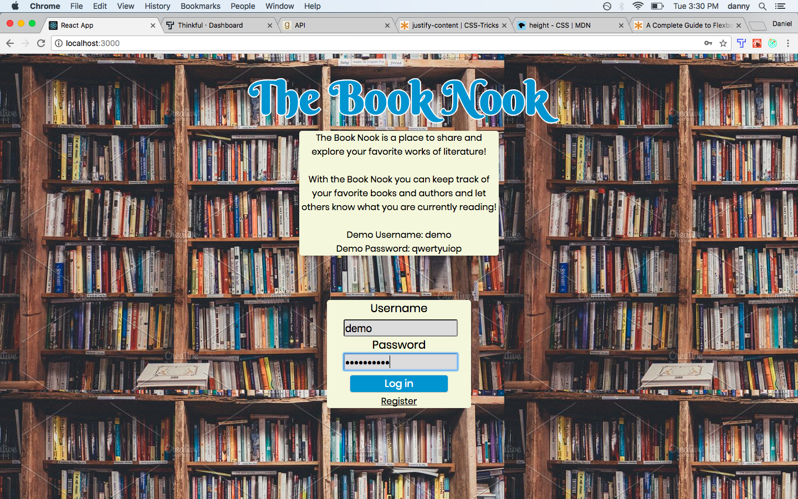
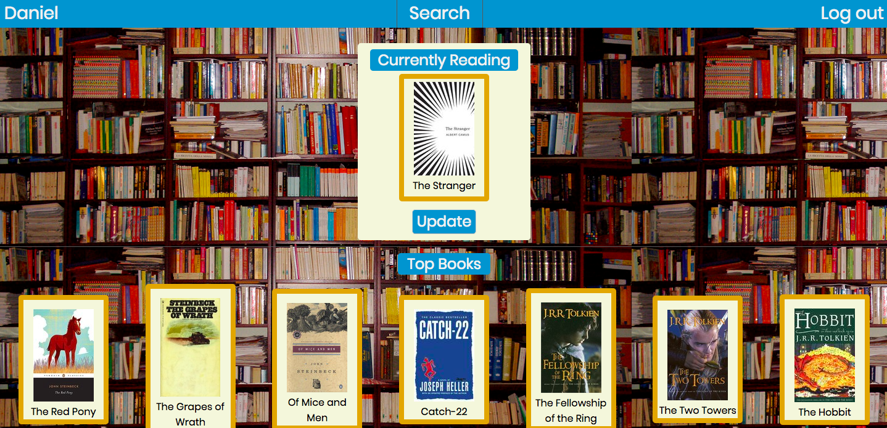
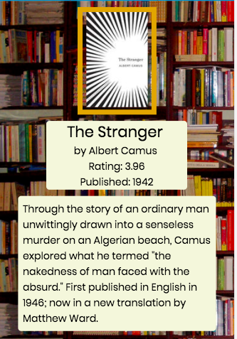

# books-client

The Book Nook is a responsive full-stack app that allows you to save and explore your favorite literature from the web.

Summary:  The Book Nook makes use of Goodreads API to help you find your favorite books and authors from its online database. 
You can then display the books you are currently reading, your favorite books, and your favorite authors to your profile page.  Each book 
and author saved also contains information about the respective item, enabling you to learn more about these literary works. The Book Nook 
also has a social aspect, allowing your profile to be seen by other users and for you to view their profiles.  

Technology:

Front End: HTML, React, CSS, Javascript
Back End: Node.Js + Express, MongoDB, CI and Deployment with TravisCI

